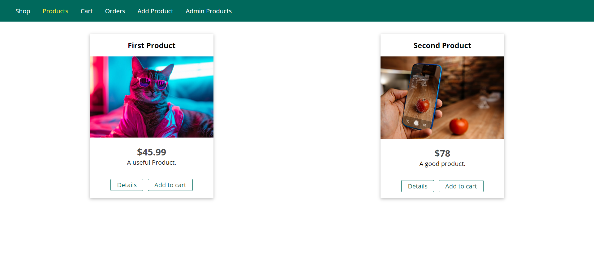
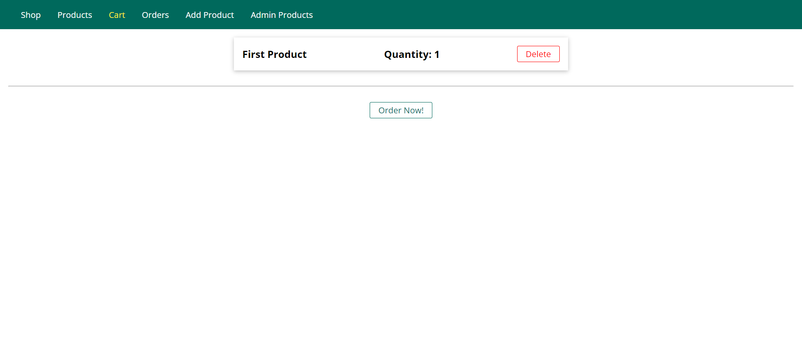
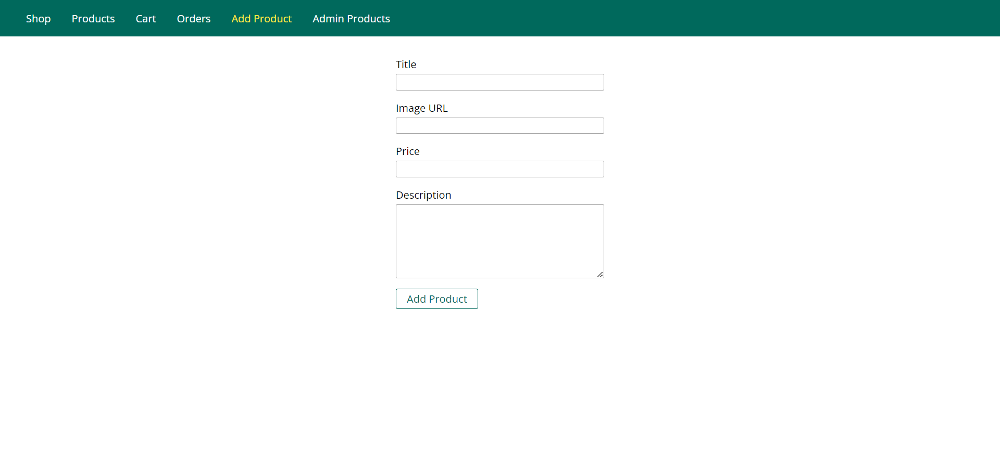
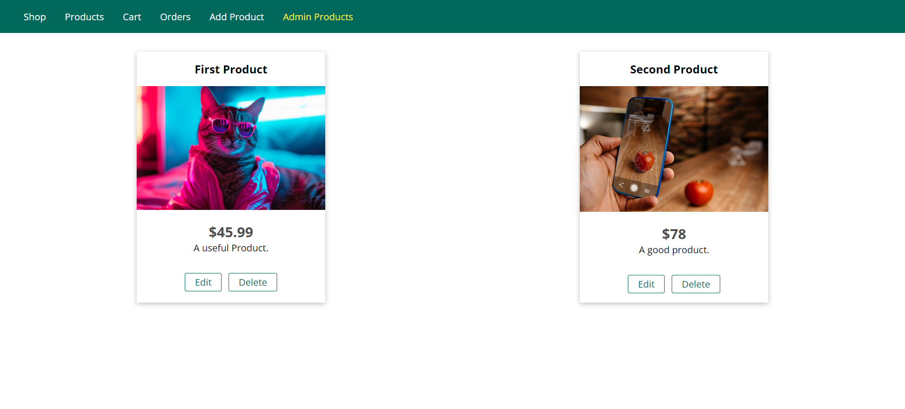
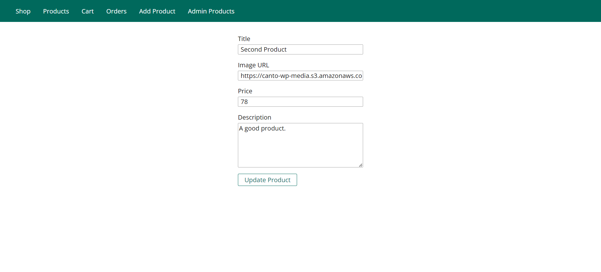
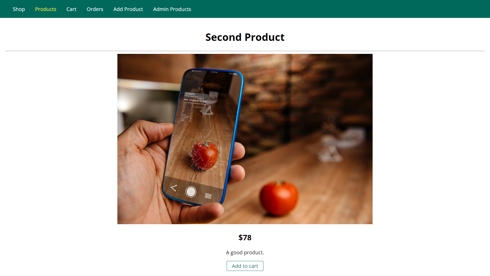

After trying to store data in variables then in files then using Sql through the sql2 package we applied the sequelize ORM in our node.js project
here are some screenshots showcasing the functionalities of the app

